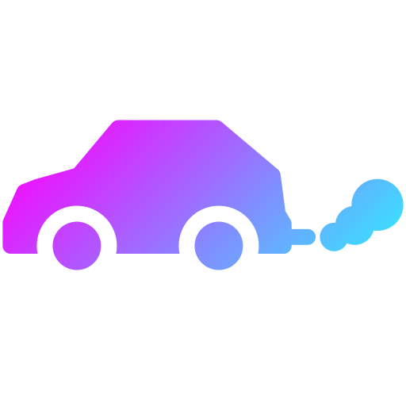
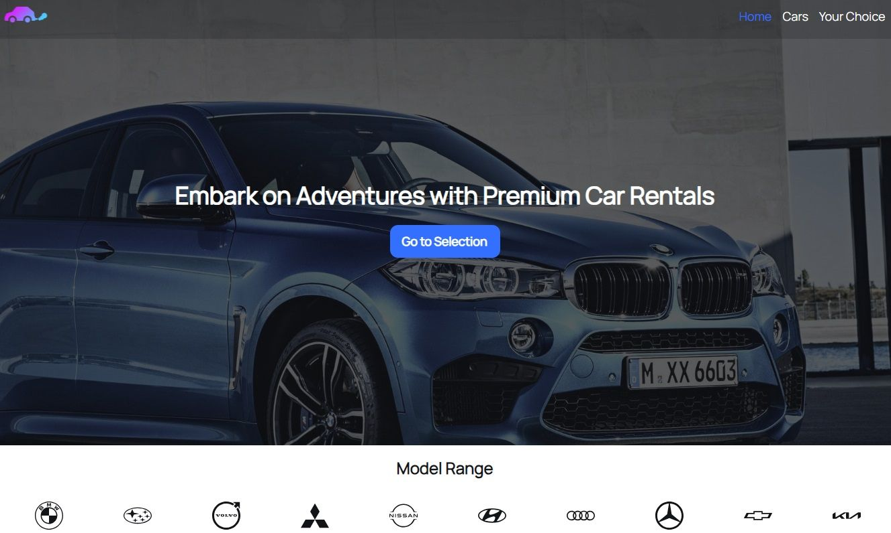
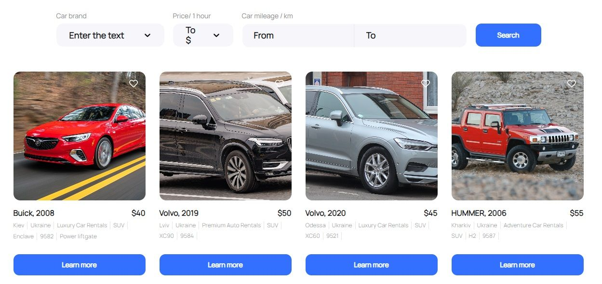
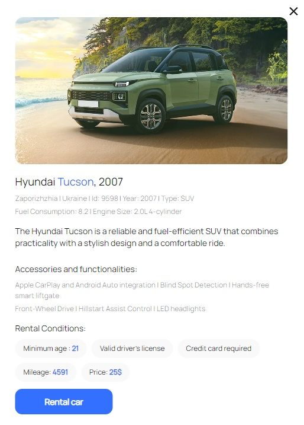

# Cars Ukraine



## Description

**Welcome to Cars Ukraine — your premier destination for hassle-free car rentals
in Ukraine. Discover the freedom to explore the beauty of the country at your
own pace with our diverse fleet of high-quality vehicles.**

## Getting Started

1. Clone the repository:

```
git clone https://github.com/ishkov2709/cars-ukraine.git
```

2. Navigate to the project directory:

```
cd cars-ukraine
```

3. Install dependencies:

```
npm install
```

4. Run the application:

```
npm start
```

## Project Structure

**src**:

- **components**: Reusable React components
- **constants**
- **img**
- **pages**: Components representing individual pages of the application.
- **store**: Redux Store
- **styles**: Style files

## Demo







## Used Libraries

**_Frontend_**

- **React.js**
- **React Router**
- **Redux Toolkit**
- **Redux Persist**
- **React Spinners**
- **styled-components**
- **Axios**

**_Backend_**

- **mockAPI**
